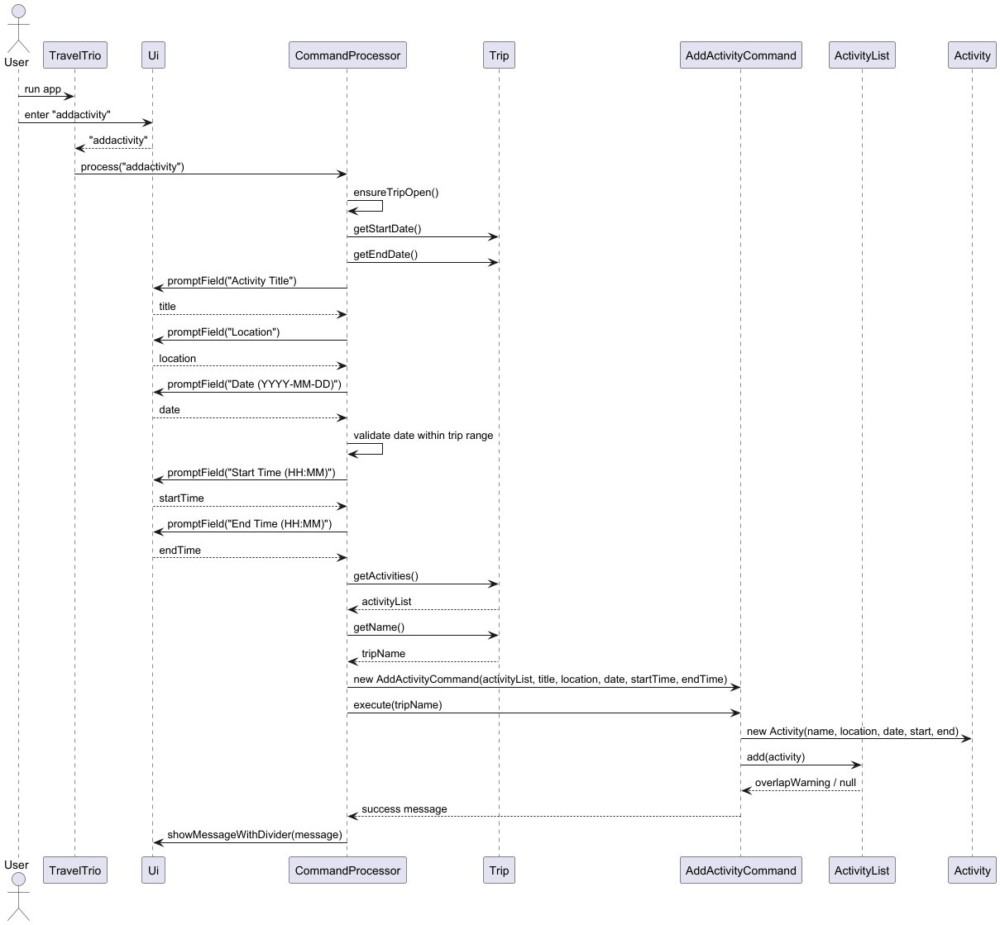

# Developer Guide

## Acknowledgements

{list here sources of all reused/adapted ideas, code, documentation, and third-party libraries -- include links to the original source as well}

## Design & implementation

{Describe the design and implementation of the product. Use UML diagrams and short code snippets where applicable.}

### Add Activity to Itinerary feature
**Implementation** 
The `addactivity` feature is facilitated by `AddActivityCommand`. It allows the user to create a new `Activity` and add it to the `ActivityList` of the currently opened `Trip`.

The feature mainly involves the following classes:
- AddActivityCommand — adds a new Activity into the activity list.
- Activity — represents a single activity with fields such as name, location, date, start time, and end time.
- ActivityList — stores all Activity objects belonging to a trip.
- Trip — owns the corresponding ActivityList.

The `AddActivityCommand` receives the target `ActivityList` of the currently opened `Trip` and the `Activity` to be added. 
When `AddActivityCommand#execute()` is called, the activity is appended to the list and a success message is returned.

Given below is an example usage scenario and how the add activity mechanism behaves at each step.

Step 1. The user opens a trip, for example Japan Trip. The opened Trip contains an `ActivityList`, which may initially be empty.

Step 2. The user executes an `addactivity` command with the relevant activity details, such as activity name, location, date, and time.

Step 3. The application parses the user input and constructs a new Activity object containing the specified details.

Step 4. The application creates an `AddActivityCommand`, passing in the current trip’s ActivityList and the newly created Activity.

Step 5. The user command is executed through `AddActivityCommand#execute()`. The command calls `ActivityList#add(activity)`, causing the new `activity` to be stored in the list.

Step 6. A success message is returned to the user, showing that the activity has been successfully added.

If the command input is invalid, or if no trip is currently opened, the command will not be executed successfully and no activity will be added.

**Sequence Diagram:**

The following sequence diagram shows how an operation to add an activity goes:

## Product scope
### Target user profile

{Describe the target user profile}

### Value proposition

{Describe the value proposition: what problem does it solve?}

## User Stories

|Version| As a ...              | I want to ...                                                                 | So that I can ...                                                    |
|--------|-----------------------|-------------------------------------------------------------------------------|----------------------------------------------------------------------|
|v1.0| new user              | see usage instructions                                                        | refer to them when I forget how to use the application               |
|v1.0| Organized user        | view all acitivities that I had added to the activity list at once            | see all of the activities i had planned for my trip                  |
|v1.0| Organized user        | add activities to a trip with details (e.g., activity name, time and location | append new activity to my list of activities in the itinerary        |
|v2.0| Thrifty User          | record my actual spending for planned activities                              | easily track and compare my actual expenses against my planned budget |

## Non-Functional Requirements

{Give non-functional requirements}

## Glossary

* *glossary item* - Definition

## Instructions for manual testing

{Give instructions on how to do a manual product testing e.g., how to load sample data to be used for testing}
